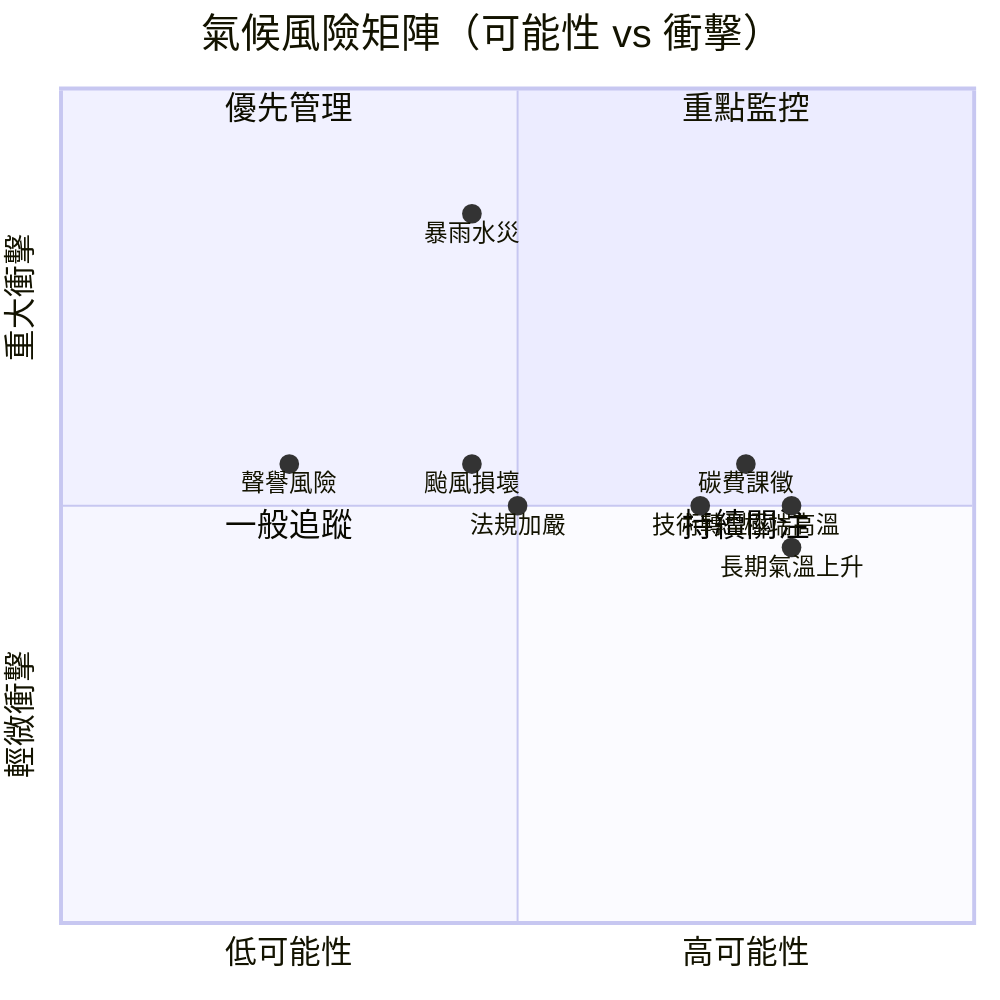

# 氣候風險評估矩陣(TCFD)

document_id: MTX-RISK-CLIMATE

## 1. 目的與範圍

本矩陣依據氣候相關財務揭露工作小組（TCFD）建議書框架，評估國軍臺中總醫院面臨之氣候相關風險與機會，分析其可能性、衝擊及本院之因應策略，作為 ESG 委員會決策與 POL-ESG 氣候承諾執行之基礎。

**分析時間維度：**
- 短期：1–3 年（2026–2028）
- 中期：3–10 年（2028–2035）
- 長期：10 年以上（2035 以後）

**更新週期：** 每年 Q1 由醫務企劃管理室更新，提交 ESG 委員會審查確認。

## 2. 風險分類架構（TCFD）

TCFD 將氣候相關風險分為兩大類：

- **實體風險（Physical Risks）：** 氣候變遷直接造成的物理損害，包含急性（極端天氣事件）與慢性（長期氣候趨勢）。
- **轉型風險（Transition Risks）：** 向低碳經濟轉型過程中產生的政策法規、技術、市場及聲譽風險。

可能性分級：**高（≥50%）、中（20–50%）、低（<20%）**

衝擊分級：**重大（影響核心醫療業務或財務衝擊 > 新臺幣 500 萬元）、中等（影響部分業務運作或財務衝擊 100–500 萬元）、輕微（有限影響，財務衝擊 < 100 萬元）**

## 3. 實體風險評估

### 3.1 急性實體風險

| 風險項目 | 風險描述 | 時間維度 | 可能性 | 衝擊 | 財務影響估計 | 因應策略 |
|------|------|:---:|:---:|:---:|------|------|
| **極端高溫** | 氣溫超過 38°C 之熱浪天數增加，導致熱傷害病患急增、急診壅塞，院內空調負荷大增使電力成本上升，同時可能導致醫護人員中暑影響出勤率 | 短/中期 | 高 | 中等 | 電力費增加每年估計 50–150 萬元；急診服務量增加人力成本 | 加強空調維護與效能管理（GDL-EQUIP）；醫護人員熱傷害防護措施；擬定極端高溫應變計畫；評估備用電力設備容量 |
| **暴雨及水災** | 短延時強降雨或颱風帶來之豪雨，導致本院地下室（停車場、設備機房）淹水，損壞電力設備、空調主機及醫療設備；同時影響病患及員工進出院區 | 短/中期 | 中 | 重大 | 設備損壞修復費估計 200–800 萬元；業務中斷損失另計 | 地下室防水閘門及抽水機維護；重要設備移高保護措施；緊急應變計畫（含業務持續計畫）；院區排水設施定期清通 |
| **颱風** | 中度以上颱風造成建築外牆損壞、玻璃帷幕破損、停電、醫療物資補給中斷，影響醫療服務持續性 | 短/中期 | 中 | 中等 | 建築修繕費估計 100–500 萬元；業務中斷期間成本另計 | 定期建築安全巡查；颱風前設施固定標準作業程序；緊急電力備援（UPS + 緊急發電機）；醫療物資備儲計畫 |

### 3.2 慢性實體風險

| 風險項目 | 風險描述 | 時間維度 | 可能性 | 衝擊 | 財務影響估計 | 因應策略 |
|------|------|:---:|:---:|:---:|------|------|
| **長期氣溫上升** | 年均氣溫持續上升使全年冷氣使用天數增加，院內整體電力消耗及碳排放基準線提高，使減碳目標達成難度增加 | 中/長期 | 高 | 中等 | 年度電力費增加（估計每 1°C 氣溫上升約增加 2–5% 用電量） | 提前推動高效能空調汰換；建置能源管理監控系統；評估太陽能裝設以降低外購電力依賴 |
| **海平面上升（區域）** | 臺中市非沿海低窪地區，海平面上升直接衝擊有限，但可能加劇極端降雨頻率與強度 | 長期 | 低 | 輕微 | 間接影響，難以量化 | 持續監控氣候科學研究，視情況更新風險評估 |

## 4. 轉型風險評估

| 風險項目 | 風險描述 | 時間維度 | 可能性 | 衝擊 | 財務影響估計 | 因應策略 |
|------|------|:---:|:---:|:---:|------|------|
| **碳費/碳稅課徵** | 《溫室氣體管理法》施行後，主管機關可能對年排放量超過門檻之排放源課徵碳費（依環境部公告費率）。本院 2025 年排放量約 3,098 tCO2e，若碳費費率為 300 元/公噸，年度成本約 93 萬元；費率若調高至 1,200 元/公噸，則達 372 萬元 | 短期 | 高 | 中等 | 按現行草案費率估計 93–372 萬元/年（隨費率調整） | 積極推動減碳措施（PLN-ENERGY）以降低排放基數；建立碳費預算準備機制；追蹤環境部費率公告動態 |
| **法規加嚴（盤查義務擴大）** | 未來法規可能要求醫院擴大盤查範圍至類別 3 供應鏈排放，或縮短盤查申報期限，增加盤查作業人力與成本 | 中期 | 中 | 中等 | 盤查範圍擴大增加顧問費及作業人力，估計每年增加 50–150 萬元 | 持續追蹤法規動態；預先建立類別 3 排放數據收集機制；培育內部盤查人才 |
| **高效能設備技術轉型** | 市場快速轉向高效能設備（如 COP > 5 的空調、LED 智慧照明），現有設備若不升級，能源成本相較競爭醫院偏高，且難以符合綠建築及節能法規要求 | 短/中期 | 高 | 中等 | 汰換高效設備資本支出（分三年，估計總計 500–1,500 萬元） | 依 PLN-ENERGY 排定設備汰換優先序；申請政府節能補助；採購規格納入能效標章要求（GDL-EQUIP） |
| **聲譽風險（ESG 揭露不足）** | 若本院未能按時完成溫室氣體盤查、評鑑或 ESG 報告，可能損害本院在軍醫局、合作夥伴及社區民眾間的信譽，影響預算核撥及病患就醫意願 | 短期 | 低 | 中等 | 難以量化，但可能影響預算審核與政策支持 | 依 MTX-TIMELINE 嚴格管控關鍵時程；確保年度 ESG 報告及時發布；強化利害關係人溝通（MTX-STAKEHOLDER） |

## 5. 氣候機會評估

| 機會項目 | 機會描述 | 時間維度 | 可能性 | 潛在效益 | 因應策略 |
|------|------|:---:|:---:|------|------|
| **再生能源導入** | 在院區屋頂設置太陽能光電板，降低外購電力依賴，減少電費支出並降低排碳係數 | 中期 | 中 | 年節省電費估計 50–200 萬元；減少碳排放 | PLN-ENERGY 已列入可行性評估（E2-12） |
| **綠建築新大樓** | 新建醫療大樓取得 EEWH 綠建築認證，提升設施能效等級，降低長期運營能源成本，並強化本院 ESG 形象 | 中期 | 中 | 能源成本節省（較傳統建築降低 20–30%）；ESG 形象提升 | PLN-CONSTRUCTION 及 GDL-GREEN-BUILD 已啟動規劃 |
| **氣候適應醫療服務** | 因應極端氣候導致熱傷害及氣候相關疾病增加，本院提前強化相關醫療能量，提升就醫量與社會貢獻 | 短期 | 高 | 服務量提升（難以量化）；社區聲譽提升 | 熱傷害、呼吸道、感染症醫療能量提升計畫 |

## 6. 風險矩陣視覺化

## 7. 治理架構

氣候風險之治理由 ESG 委員會（PRO-ESG-COMMITTEE）負責，每季審查風險狀態，重大風險報告由副院長核決後列入院級決策。本矩陣每年 Q1 更新，若發生重大氣候事件（如颱風水災）則立即觸發臨時更新程序。
