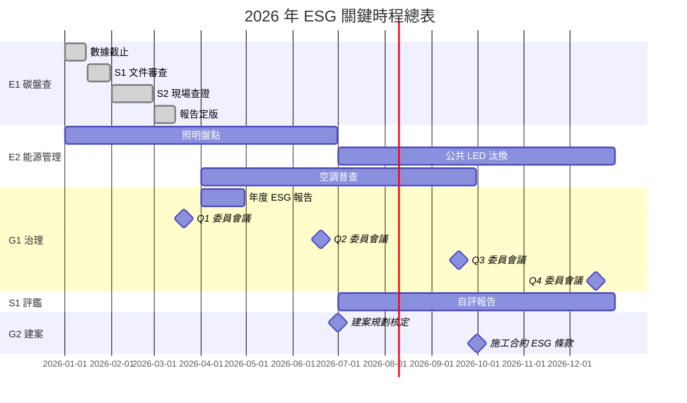

# 關鍵時程總表

document_id: MTX-TIMELINE

## 1. 目的與範圍

本總表彙整國軍臺中總醫院所有 ESG 相關之關鍵截止日期與里程碑，作為醫務企劃管理室追蹤管理之核心工具，並供 ESG 委員會季度審查之依據。

機器可讀版本（供 `collectors/deadline-check.sh` 讀取）詳見本目錄下之 `milestones.yaml`。

**更新頻率：** 每月最後一個工作天由醫務企劃管理室更新實際完成日期與狀態；年度更新於每年 12 月底前完成。

## 2. 時程總表

### 2.1 E1 碳盤查類

| 里程碑編號 | 里程碑名稱 | 類別 | 預定日期 | 實際日期 | 狀態 | 負責單位 |
|------|------|------|------|------|------|------|
| GHG-DATA-CLOSE | 溫盤數據截止（所有 FRM 表單） | E1-碳盤查 | 2027-01-15 | — | pending | 醫務企劃管理室 |
| GHG-S1 | 溫盤 S1 文件審查（第三方） | E1-碳盤查 | 2027-01-31 | — | pending | 醫務企劃管理室 |
| GHG-S2 | 溫盤 S2 現場查證（第三方） | E1-碳盤查 | 2027-02-28 | — | pending | 醫務企劃管理室 |
| GHG-FINAL | 溫盤報告定版發行 | E1-碳盤查 | 2027-03-15 | — | pending | 醫務企劃管理室 |

> 2026 年度（盤查 2025 年數據）對應時程：GHG-DATA-CLOSE 2026-01-15、GHG-S1 2026-01-31、GHG-S2 2026-02-28、GHG-FINAL 2026-03-15（已完成，詳見 RPT-GHG-2025）。

### 2.2 E2 能源管理類

| 里程碑編號 | 里程碑名稱 | 類別 | 預定日期 | 實際日期 | 狀態 | 負責單位 |
|------|------|------|------|------|------|------|
| ENERGY-LED-SURVEY | 全院照明盤點完成（LED 汰換清冊） | E2-能源管理 | 2026-06-30 | — | pending | 行政組 |
| ENERGY-LED-PUB | 公共區域 LED 汰換完成 | E2-能源管理 | 2026-12-31 | — | pending | 行政組 |
| ENERGY-AC-SURVEY | 空調能效普查完成 | E2-能源管理 | 2026-09-30 | — | pending | 行政組 |

### 2.3 S1 醫院評鑑類

| 里程碑編號 | 里程碑名稱 | 類別 | 預定日期 | 實際日期 | 狀態 | 負責單位 |
|------|------|------|------|------|------|------|
| ACCRED-SELFEVAL | 評鑑自我評估報告完成 | S1-醫院評鑑 | 2026-12-31 | — | pending | 醫務企劃管理室 |
| ACCRED-SUBMIT | 評鑑資料送件 | S1-醫院評鑑 | — | — | pending | 醫務企劃管理室 |

> 評鑑送件日期依衛生福利部通知為準，確認後更新本表。

### 2.4 G1 ESG 治理類

| 里程碑編號 | 里程碑名稱 | 類別 | 預定日期 | 實際日期 | 狀態 | 負責單位 |
|------|------|------|------|------|------|------|
| ESG-RPT-2025 | 年度 ESG 報告書發布（含 GHG-2025） | G1-ESG治理 | 2026-04-30 | — | pending | 醫務企劃管理室 |
| ESG-Q1-MTG | ESG 委員會 Q1 會議 | G1-ESG治理 | 2026-03-20 | — | pending | 醫務企劃管理室 |
| ESG-Q2-MTG | ESG 委員會 Q2 會議 | G1-ESG治理 | 2026-06-19 | — | pending | 醫務企劃管理室 |
| ESG-Q3-MTG | ESG 委員會 Q3 會議 | G1-ESG治理 | 2026-09-18 | — | pending | 醫務企劃管理室 |
| ESG-Q4-MTG | ESG 委員會 Q4 年度會議 | G1-ESG治理 | 2026-12-18 | — | pending | 醫務企劃管理室 |
| STAKEHOLDER-UPDATE | 利害關係人矩陣年度更新 | G1-ESG治理 | 2026-03-31 | — | pending | 醫務企劃管理室 |
| CLIMATE-RISK-UPDATE | 氣候風險矩陣年度更新 | G1-ESG治理 | 2026-03-31 | — | pending | 醫務企劃管理室 |

### 2.5 G2 建案管理類

| 里程碑編號 | 里程碑名稱 | 類別 | 預定日期 | 實際日期 | 狀態 | 負責單位 |
|------|------|------|------|------|------|------|
| CONST-PLN-APPROVED | 建案 ESG 規劃文件核定 | G2-建案管理 | 2026-06-30 | — | pending | 行政組 |
| CONST-CONTRACT-ESG | 施工合約 ESG 條款簽訂 | G2-建案管理 | 2026-09-30 | — | pending | 行政組 |
| CONST-HANDOVER | 建物點交 | G2-建案管理 | — | — | pending | 行政組 |
| CONST-GHG-EXPAND | 盤查邊界擴充（點交後） | G2-建案管理 | — | — | pending | 醫務企劃管理室 |

### 2.6 G3 時程管制類

| 里程碑編號 | 里程碑名稱 | 類別 | 預定日期 | 實際日期 | 狀態 | 負責單位 |
|------|------|------|------|------|------|------|
| PLN-ANNUAL-NEXT | 次年 ESG 工作計畫定版 | G3-時程管制 | 2026-12-31 | — | pending | 醫務企劃管理室 |
| TIMELINE-UPDATE | 關鍵時程總表年度更新 | G3-時程管制 | 2026-12-31 | — | pending | 醫務企劃管理室 |

## 3. 各月 ESG 重要事項與截止日期

以下為 2026 年度各月份分配之 ESG 重要事項及對應截止日期，作為各單位月度工作優先序之參考：

| 月份 | ESG 重要事項 | 截止日期 | 負責單位 | 對應里程碑 |
|------|------|------|------|------|
| 1 月 | 溫盤全年數據彙整截止；S1 文件審查送件 | 01-15（數據截止）；01-31（S1 完成） | 醫務企劃管理室 | GHG-DATA-CLOSE、GHG-S1 |
| 2 月 | S2 現場查證完成 | 02-28 | 醫務企劃管理室 | GHG-S2 |
| 3 月 | 溫盤報告定版發行；利害關係人矩陣年度更新；氣候風險矩陣年度更新；ESG 委員會 Q1 會議 | 03-15（報告定版）；03-20（Q1 會議）；03-31（矩陣更新） | 醫務企劃管理室 | GHG-FINAL、ESG-Q1-MTG、STAKEHOLDER-UPDATE、CLIMATE-RISK-UPDATE |
| 4 月 | 年度 ESG 報告書發布 | 04-30 | 醫務企劃管理室 | ESG-RPT-2025 |
| 5 月 | ESG 月度進度表（FRM-PROGRESS）填報；各 FRM 表單前四月數據確認 | 05-31（月底前） | 各填報單位 | — |
| 6 月 | 全院照明盤點完成（LED 汰換清冊）；建案 ESG 規劃文件核定；ESG 委員會 Q2 會議 | 06-19（Q2 會議）；06-30（照明盤點、建案規劃） | 行政組、醫務企劃管理室 | ENERGY-LED-SURVEY、CONST-PLN-APPROVED、ESG-Q2-MTG |
| 7 月 | 評鑑自我評估報告啟動 | 07-01 起持續推進 | 醫務企劃管理室 | ACCRED-SELFEVAL |
| 8 月 | 上半年 ESG 績效中期檢討 | 08-31 | 醫務企劃管理室 | — |
| 9 月 | 空調能效普查完成；施工合約 ESG 條款簽訂；ESG 委員會 Q3 會議 | 09-18（Q3 會議）；09-30（空調普查、施工合約） | 行政組、醫務企劃管理室 | ENERGY-AC-SURVEY、CONST-CONTRACT-ESG、ESG-Q3-MTG |
| 10 月 | 水資源再利用可行性評估啟動（Q4）；評鑑自評報告持續推進 | 10-31 | 行政組 | — |
| 11 月 | 次年 ESG 工作計畫草案討論 | 11-30 | 醫務企劃管理室 | — |
| 12 月 | 公共區域 LED 汰換完成；評鑑自我評估報告完成；次年 ESG 工作計畫定版；關鍵時程總表年度更新；ESG 委員會 Q4 年度會議 | 12-18（Q4 會議）；12-31（LED 完成、自評報告、年計畫、時程更新） | 行政組、醫務企劃管理室 | ENERGY-LED-PUB、ACCRED-SELFEVAL、PLN-ANNUAL-NEXT、TIMELINE-UPDATE、ESG-Q4-MTG |

**每月例行性 ESG 工作（全年每月截止日）：**

| 每月例行工作 | 截止日 | 負責單位 |
|------|------|------|
| FRM-DATA-FUEL 油料月報填報 | 次月 15 日 | 行政組 |
| FRM-DATA-ELEC 電力月報填報 | 次月 15 日 | 行政組 |
| FRM-WASTE-MON 廢棄物月報填報 | 次月 10 日 | 醫勤組 |
| FRM-WATER-MON 用水月報填報 | 次月 10 日 | 行政組 |
| FRM-PROGRESS ESG 月度進度表填報 | 月底最後一個工作天 | 各 ESG 權責單位 |
| MTX-TIMELINE 狀態更新 | 月底最後一個工作天 | 醫務企劃管理室 |

## 4. 狀態定義

| 狀態值 | 說明 |
|------|------|
| `pending` | 尚未到期，等待執行 |
| `in_progress` | 正在執行中 |
| `completed` | 已完成，實際日期已填入 |
| `overdue` | 已超過預定日期但尚未完成 |
| `not_applicable` | 本年度不適用（如評鑑非本年度） |

## 5. 預警機制

`collectors/deadline-check.sh` 依據 `milestones.yaml` 自動執行以下預警：

| 預警類型 | 觸發條件 | 通知對象 |
|------|------|------|
| 30 天預警 | 距預定日期 ≤ 30 天，狀態為 `pending` | 醫務企劃管理室 |
| 7 天預警 | 距預定日期 ≤ 7 天，狀態為 `pending` 或 `in_progress` | 醫務企劃管理室、負責單位主管 |
| 逾期警示 | 預定日期已過，狀態非 `completed` | 醫務企劃管理室、ESG 召集人 |

## 6. 視覺化時程圖（2026 年度）

## 7. 相關文件

- **PLN-ANNUAL：** 年度 ESG 工作計畫（詳細行動項目）
- **FRM-PROGRESS：** ESG 月度進度表（各單位填報）
- **PRO-ESG-COMMITTEE：** ESG 委員會運作程序（會議時程）
- **milestones.yaml：** 機器可讀里程碑資料（本目錄）
