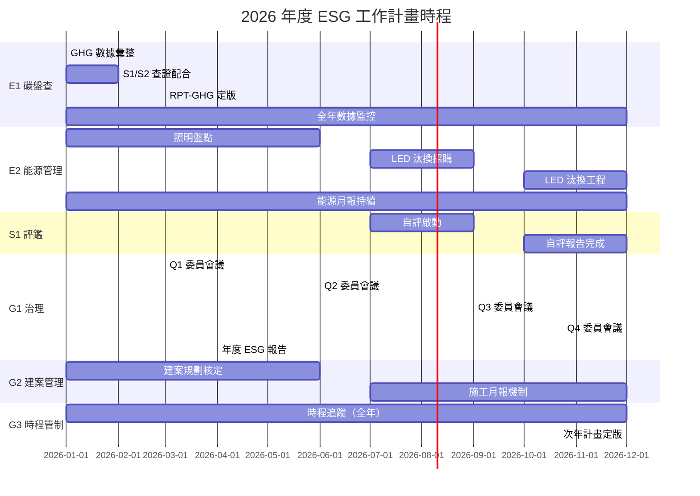

# 年度 ESG 工作計畫

document_id: PLN-ANNUAL

## 1. 計畫目的與範圍

本計畫整合國軍臺中總醫院年度 ESG 各構面之工作項目、負責人、KPI 與預算配置，作為全年 ESG 執行的管理依據，並與 MTX-TIMELINE 關鍵時程總表相互對照，確保各項任務依期完成。

**計畫年度：** 2026 年（1 月 1 日至 12 月 31 日）

**計畫擁有者：** 醫務企劃管理室

**核定單位：** ESG 委員會（PRO-ESG-COMMITTEE）

本計畫每年 12 月底前更新次年版本，並提交 ESG 委員會 Q4 年度會議核定。

## 2. 年度總體目標

| ESG 構面 | 2026 年度目標 | KPI 衡量標準 |
|------|------|------|
| **E1 碳盤查** | 完成 2025 年度溫室氣體盤查並取得第三方查證聲明書 | 查證聲明書核發日期 ≤ 2026-03-31 |
| **E2 能源管理** | 年度用電量較 2025 年減少 3%；LED 燈具汰換盤點完成 | FRM-ENERGY-MON 月報年度加總；LED 清冊建立 |
| **E3 廢棄物** | 醫療廢棄物妥善處置率 100%；一般廢棄物資源回收率 ≥ 25% | 廢棄物清除申報紀錄 |
| **E4 水資源** | 建立全院用水月報機制（FRM-WATER-MON）；年度用水量基準建立 | FRM-WATER-MON 月報完整度 100% |
| **S1 醫院評鑑** | 完成評鑑自我評估報告（RPT-SELF-EVAL）；維持評鑑合格資格 | 自評報告提交日期；評鑑合格維持 |
| **S2 職業安全** | 職業災害死亡件數 0 件；年度安全衛生教育訓練完成率 ≥ 95% | 職災紀錄（FRM-INCIDENT）；訓練出席紀錄 |
| **S3 社區參與** | 社區健康活動至少辦理 2 場次；義診服務至少 1 次 | 活動辦理紀錄（RPT-COMMUNITY） |
| **G1 ESG 治理** | ESG 委員會季度會議 4 次全數召開；完成利害關係人矩陣更新 | 會議紀錄；MTX-STAKEHOLDER 版本 |
| **G2 建案管理** | 建案 ESG 規劃文件核定；施工 ESG 月報機制建立 | PLN-CONSTRUCTION 核定；月報紀錄 |
| **G3 時程管制** | MTX-TIMELINE 關鍵時程達成率 ≥ 90%；FRM-PROGRESS 月報零缺漏 | 時程達成率統計；FRM-PROGRESS 完整度 |

## 3. 季度行動計畫

### 3.1 Q1（1 月–3 月）

| 工作項目 | 構面 | 負責單位 | 期限 | 預算需求 |
|------|:---:|------|------|------|
| 完成 2025 年度 GHG 年度數據彙整 | E1 | 醫務企劃管理室 | 1/15 | 無 |
| 完成 GHG 盤查 S1 文件審查配合 | E1 | 醫務企劃管理室 | 1/31 | 查證費已編列 |
| 完成 GHG 盤查 S2 現場查證配合 | E1 | 醫務企劃管理室 | 2/28 | 含於查證費 |
| 取得查證聲明書，完成 RPT-GHG 定版 | E1 | 醫務企劃管理室 | 3/15 | 無 |
| Q1 能源月報（FRM-ENERGY-MON）填報與彙整 | E2 | 行政組 | 各月 15 日前 | 無 |
| 照明燈具盤點啟動（E2-01） | E2 | 行政組 | 3/31 | 無（內部盤點） |
| Q1 廢棄物月報彙整 | E3 | 行政組 | 各月 15 日前 | 無 |
| Q1 用水月報（FRM-WATER-MON）填報 | E4 | 行政組 | 各月 15 日前 | 無 |
| 更新利害關係人矩陣（MTX-STAKEHOLDER） | G1 | 醫務企劃管理室 | 3/31 | 無 |
| 更新氣候風險矩陣（MTX-RISK-CLIMATE） | G1 | 醫務企劃管理室 | 3/31 | 無 |
| ESG 委員會 Q1 會議召開 | G1 | 醫務企劃管理室 | 3 月第三週 | 無 |
| 發布年度 ESG 報告書（含 RPT-GHG-2025） | G1 | 醫務企劃管理室 | 4/30 前（Q1 準備） | 無 |

### 3.2 Q2（4 月–6 月）

| 工作項目 | 構面 | 負責單位 | 期限 | 預算需求 |
|------|:---:|------|------|------|
| 年度 ESG 報告書發布 | G1 | 醫務企劃管理室 | 4/30 | 無 |
| Q2 能源月報填報與彙整 | E2 | 行政組 | 各月 15 日前 | 無 |
| 照明燈具盤點完成（LED 汰換清冊建立） | E2 | 行政組 | 6/30 | 無 |
| Q2 廢棄物月報彙整 | E3 | 行政組 | 各月 15 日前 | 無 |
| Q2 用水月報填報 | E4 | 行政組 | 各月 15 日前 | 無 |
| 職安衛委員會月會（每月） | S2 | 職業安全衛生室 | 每月 | 無 |
| 社區健康活動第一場次辦理 | S3 | 民眾診療服務處 | 6/30 | 已編列社區服務經費 |
| 建案 ESG 規劃文件核定（PLN-CONSTRUCTION） | G2 | 行政組 | 6/30 | 無 |
| EEWH 銀級設計要求確認（建案） | G2 | 行政組 | 6/30 | 顧問費另計 |
| ESG 委員會 Q2 會議召開 | G1 | 醫務企劃管理室 | 6 月第三週 | 無 |
| 次年 ESG 工作計畫草案啟動 | G3 | 醫務企劃管理室 | 6/30（啟動） | 無 |

### 3.3 Q3（7 月–9 月）

| 工作項目 | 構面 | 負責單位 | 期限 | 預算需求 |
|------|:---:|------|------|------|
| 空調設備能效普查啟動（E2-05） | E2 | 行政組 | 9/30 | 無（內部普查） |
| 公共區域 LED 燈具汰換採購作業啟動（E2-02） | E2 | 行政組 | 9/30 | 依採購程序編列 |
| Q3 能源月報填報與彙整 | E2 | 行政組 | 各月 15 日前 | 無 |
| 醫療設備採購納入能效標章條件（E2-09） | E2 | 行政組、聯合採購小組 | 9/30 | 無（納入規範） |
| Q3 廢棄物月報彙整 | E3 | 行政組 | 各月 15 日前 | 無 |
| Q3 用水月報填報 | E4 | 行政組 | 各月 15 日前 | 無 |
| 評鑑自我評估啟動（RPT-SELF-EVAL） | S1 | 醫務企劃管理室 | 9/30（啟動） | 無 |
| 職安衛年度教育訓練執行（第二季） | S2 | 職業安全衛生室 | 9/30 | 訓練經費已編列 |
| 社區健康活動第二場次辦理 | S3 | 民眾診療服務處 | 9/30 | 已編列社區服務經費 |
| ESG 委員會 Q3 會議召開 | G1 | 醫務企劃管理室 | 9 月第三週 | 無 |
| 施工 ESG 條款採購合約簽訂（建案） | G2 | 行政組、聯合採購小組 | 9/30 | 含於建案預算 |
| 施工廢棄物月報機制建立（建案） | G2 | 行政組 | 9/30 | 無 |

### 3.4 Q4（10 月–12 月）

| 工作項目 | 構面 | 負責單位 | 期限 | 預算需求 |
|------|:---:|------|------|------|
| 全年 GHG 盤查數據品質最終確認 | E1 | 醫務企劃管理室 | 12/31 | 無 |
| 公共區域 LED 燈具汰換工程完成（E2-02） | E2 | 行政組 | 12/31 | 依採購結果 |
| Q4 能源月報填報與彙整 | E2 | 行政組 | 各月 15 日前 | 無 |
| Q4 廢棄物月報彙整 | E3 | 行政組 | 各月 15 日前 | 無 |
| Q4 用水月報填報 | E4 | 行政組 | 各月 15 日前 | 無 |
| 評鑑自我評估報告完成（RPT-SELF-EVAL） | S1 | 醫務企劃管理室 | 12/31 | 無 |
| 職安衛年度績效回顧 | S2 | 職業安全衛生室 | 12/31 | 無 |
| ESG 委員會 Q4 年度會議召開 | G1 | 醫務企劃管理室 | 12 月第三週 | 無 |
| 次年 ESG 工作計畫（PLN-ANNUAL）定版核定 | G3 | 醫務企劃管理室 | 12/31 | 無 |
| 年度 ESG KPI 達成情形彙整報告 | G3 | 醫務企劃管理室 | 12/31 | 無 |
| 次年 MTX-TIMELINE 更新 | G3 | 醫務企劃管理室 | 12/31 | 無 |

## 4. 預算配置概覽

| 項目 | 預計金額（新臺幣萬元） | 預算科目 | 負責單位 |
|------|:---:|------|------|
| 溫室氣體第三方查證費用 | 30–50 | 業務費 | 醫務企劃管理室 |
| LED 燈具汰換（公共區域第一階段） | 100–300 | 設備費 | 行政組 |
| 空調能效普查（顧問服務） | 10–30 | 業務費 | 行政組 |
| 社區健康活動（2 場次） | 5–15 | 業務費 | 民眾診療服務處 |
| 職安衛教育訓練 | 5–10 | 訓練費 | 職業安全衛生室 |
| 建案 ESG 顧問費（EEWH 諮詢） | 20–50 | 業務費 | 行政組 |
| **合計（估計）** | **170–455** | | |

## 5. 時程甘特圖

## 6. 監控與檢討

- **月度：** 醫務企劃管理室彙整各單位 FRM-PROGRESS 月度進度表，確認關鍵任務進度，逾期事項立即通知負責單位追趕。
- **季度：** ESG 委員會定期會議審查季度 KPI 達成情形，重大偏差提出矯正措施。
- **年度：** Q4 年度委員會議進行全年 KPI 達成率回顧，評估次年計畫調整需求。
