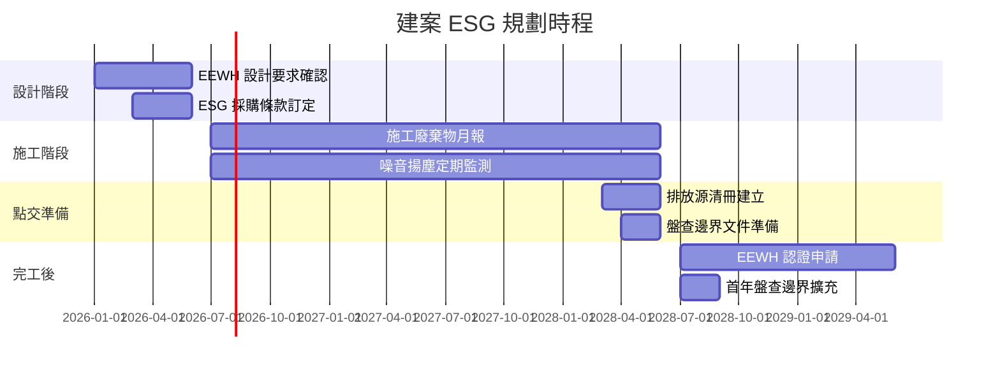

# 建案 ESG 規劃

document_id: PLN-CONSTRUCTION

## 1. 計畫目的與範圍

本計畫針對國軍臺中總醫院新建醫療大樓（以下簡稱「本建案」）擬定 ESG 整合規劃，確保建案設計、施工與點交各階段均落實環境、社會與治理要求，並為建物完工後納入本院溫室氣體盤查邊界做好準備。

**背景說明：** 依 RPT-GHG-2025 說明，新建醫療大樓「基於工程期程未能於溫室氣體盤查專案啟動前點交，爰未納入盤查作業」。本計畫確立建案點交後之盤查納入程序與過渡管理措施。

**計畫範圍：**

1. 新建醫療大樓（設計及施工期間 ESG 規劃）
2. 施工期間對既有院區之環境影響管理
3. 點交後 ESG 邊界擴充與盤查整合

**計畫期間：** 建案施工期至點交後 1 年。

## 2. 目標與 KPI

### 2.1 綠建築目標

| 目標項目 | 目標等級 | 衡量標準 | 達成期限 |
|------|------|------|------|
| EEWH 綠建築認證 | 銀級以上 | 取得內政部綠建築標章 | 建物完工後 1 年內 |
| 建築節能效率 | 較法定最低值節省 20% | EUI（能源使用強度）指標 | 設計階段確認 |
| 建材綠化率 | 採用綠建材比例 ≥ 50% | 綠建材標章產品使用比率 | 施工驗收確認 |
| 雨水回收系統 | 設置雨水回收再利用設施 | 設計圖說確認 | 設計階段確認 |

### 2.2 施工期間環境目標

| 目標項目 | 目標值 | 衡量方法 |
|------|------|------|
| 施工廢棄物資源化率 | ≥ 70% | 廢棄物清除申報紀錄 |
| 施工噪音合規率 | 100%（符合環境音量標準） | 噪音監測紀錄 |
| 施工揚塵管控 | 零環保申訴 | 環保申訴件數統計 |

## 3. ESG 邊界影響評估

### 3.1 建案對現有溫室氣體盤查邊界之影響

新建醫療大樓完工點交後，本院溫室氣體盤查邊界依據營運控制法原則，須納入以下新增排放源：

| 排放源類型 | 排放類別 | 新增排放源項目 | 預估年排放量（估計） |
|------|:---:|------|------|
| 電力使用（空調、照明、醫療設備） | 類別 2 | 新大樓外購電力 | 待點交後實測 |
| 緊急發電機 | 類別 1 | 新增柴油緊急發電機 | 待設備規格確認 |
| 冷媒（新設空調系統） | 類別 1 | 新增冷氣機組冷媒逸散 | 待設備規格確認 |

**過渡期安排：** 建物點交當年之盤查，若因點交時程晚於盤查數據截止日（每年 1 月 15 日），可延至次年盤查納入，並在 RPT-GHG 報告中說明未納入原因及時程規劃。

### 3.2 施工期間環境影響管理

| 影響類型 | 影響說明 | 管控措施 | 負責單位 |
|------|------|------|------|
| 施工廢棄物 | 拆除及新建產生大量廢棄物 | 依法申報、分類資源化、委託合格清除機構 | 行政組（監督承攬商） |
| 施工噪音 | 打樁、機械作業產生噪音 | 施工時段管制、噪音防治圍籬設置 | 行政組 |
| 施工揚塵 | 開挖、混凝土作業產生粉塵 | 圍籬加蓋、灑水降塵、車輛輪胎清洗 | 行政組 |
| 廢水排放 | 施工廢水（混凝土廢水、雨水沖刷） | 施工廢水回收沉澱槽設置，符合放流水標準後排放 | 行政組 |
| 院內動線干擾 | 施工車輛進出影響病患就醫動線 | 施工動線與病患動線分離規劃 | 行政組 |

## 4. 行動方案

| 編號 | 行動項目 | 階段 | 負責單位 | 期限 | 狀態 |
|------|------|------|------|------|------|
| G2-01 | 建案設計審查：確認 EEWH 銀級設計要求 | 設計期 | 行政組 | 設計完成前 | 未開始 |
| G2-02 | 建案施工合約納入 ESG 條款（廢棄物、噪音、揚塵） | 採購期 | 行政組、聯合採購小組 | 採購前 | 未開始 |
| G2-03 | 施工期間廢棄物月報追蹤（承攬商提交） | 施工期 | 行政組 | 每月 | 未開始 |
| G2-04 | 施工噪音與揚塵定期監測（每季至少一次） | 施工期 | 行政組 | 每季 | 未開始 |
| G2-05 | 建立新大樓排放源清冊（依 MTX-EMISSION 格式） | 點交前 3 個月 | 醫務企劃管理室 | 點交前 | 未開始 |
| G2-06 | 點交後第一年盤查邊界擴充，更新 MTX-EMISSION | 點交後 | 醫務企劃管理室 | 點交後 3 個月 | 未開始 |
| G2-07 | 申請 EEWH 綠建築認證 | 完工後 | 行政組 | 完工後 12 個月 | 未開始 |
| G2-08 | 建案里程碑月度追蹤（FRM-MILESTONE 填報） | 施工期至點交 | 行政組 | 每月 | 未開始 |

## 5. 時程

## 6. 監控與檢討機制

- **月度：** 行政組依 FRM-MILESTONE 追蹤建案里程碑，並於每月 ESG 月度進度表（FRM-PROGRESS）G2 欄位填報狀態。
- **季度：** ESG 委員會（PRO-ESG-COMMITTEE）定期審查建案 ESG 執行進度。
- **點交：** 行政組於建物點交後 30 個工作天內，完成排放源清冊更新並通知醫務企劃管理室，以納入下一年度盤查作業。

## 7. 相關文件

- **GDL-GREEN-BUILD：** 綠建築設計指引
- **FRM-MILESTONE：** 建案里程碑追蹤表
- **MTX-EMISSION：** 排放源清冊（點交後更新）
- **PRO-GHG-INV：** 溫室氣體盤查程序書
- **MTX-TIMELINE：** 關鍵時程總表
