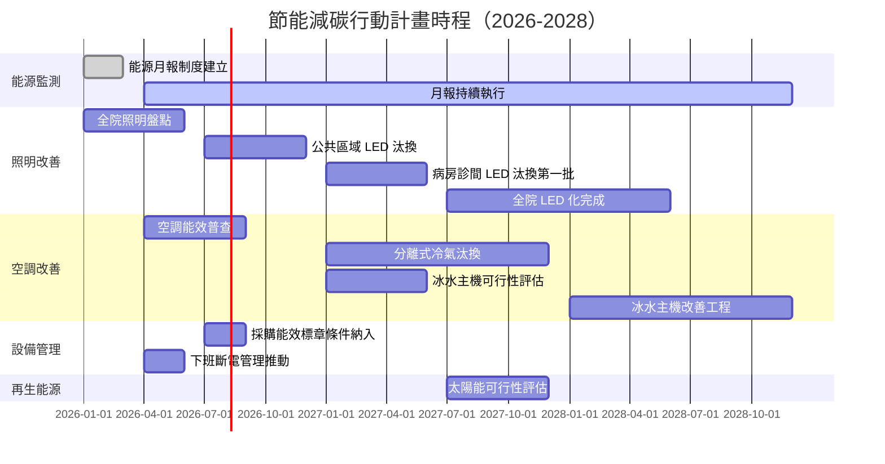

# 節能減碳行動計畫

document_id: PLN-ENERGY

## 1. 計畫目的與範圍

本計畫旨在系統性降低國軍臺中總醫院之能源消耗與溫室氣體排放，回應 POL-ESG 所訂定之環境管理政策目標，並符合政府節能減碳相關法規要求。

根據 RPT-GHG-2025 盤查結果，外購電力（類別 2 間接排放）佔本院溫室氣體總排放量約 91%，為最重要之減碳著力點。本計畫優先針對電力用量展開節能行動，輔以燃料管理措施，達成階段性減碳目標。

**適用對象：** 行政組、醫勤組、醫療部及全院各用電單位。

**計畫期間：** 2026 年 1 月至 2028 年 12 月（三年期滾動計畫，每年 12 月底前更新）。

## 2. 目標與 KPI

### 2.1 總體目標

以 2023 年溫室氣體盤查結果（RPT-GHG-2023）為基準年，2028 年底達成下列目標：

| KPI | 基準值（2023年） | 目標值（2028年） | 衡量方法 |
|------|------|------|------|
| 年度外購電力用量 | 6,302.76 MWh（依 RPT-GHG-2025 2025年數據） | 較基準年減少 10% | FRM-ENERGY-MON 月報彙整/年度加總 |
| 年度類別 2 排放量 | 2,987.51 tCO2e（2025年） | 較基準年減少 12%（含電力排碳係數改善） | RPT-GHG（年度盤查報告） |
| 節能設備汰換率 | 0%（基準） | 照明燈具 LED 化率 ≥ 95% | 行政組設備清冊盤點 |
| 空調系統能效提升 | 現有冷氣機 COP 均值（待盤點） | 汰換舊機後均值 COP ≥ 3.5 | 採購驗收紀錄 |

### 2.2 年度里程碑目標

| 年度 | 電力減少目標（相對基準年） | 主要措施 |
|------|------|------|
| 2026 | -3% | LED 燈具汰換第一階段、能源月報建立 |
| 2027 | -6% | 空調汰換第一批、冰水主機效能提升 |
| 2028 | -10% | 全院 LED 化完成、空調優化完成 |

## 3. 行動方案表格

| 編號 | 行動項目 | 類別 | 負責人 | 協辦單位 | 期限 | 預算需求 | 狀態 |
|------|------|------|------|------|------|------|------|
| E2-01 | 全院照明燈具盤點，建立 LED 汰換清冊 | 照明 | 行政組組長 | 各單位主管 | 2026-Q2 | 無（內部盤點） | 未開始 |
| E2-02 | 公共區域走廊、停車場照明全數汰換為 LED | 照明 | 行政組組長 | 廠商 | 2026-Q4 | 依採購程序編列 | 未開始 |
| E2-03 | 病房及診間照明 LED 汰換（第一批） | 照明 | 行政組組長 | 醫療部 | 2027-Q2 | 依採購程序編列 | 未開始 |
| E2-04 | 全院照明 LED 化完成（達成率 ≥ 95%） | 照明 | 行政組組長 | 各單位 | 2028-Q2 | 依採購程序編列 | 未開始 |
| E2-05 | 空調設備能效普查，建立汰換優先序清冊 | 空調 | 行政組組長 | 廠商協助 | 2026-Q3 | 無（內部普查） | 未開始 |
| E2-06 | 舊型分離式冷氣機（能效等級 3 以下）汰換 | 空調 | 行政組組長 | 廠商 | 2027-Q4 | 依採購程序編列 | 未開始 |
| E2-07 | 評估冰水主機變頻改造或整機汰換可行性 | 空調 | 行政組組長 | 廠商/顧問 | 2027-Q2 | 顧問費另計 | 未開始 |
| E2-08 | 建立能源月報制度，逐月追蹤用電趨勢 | 設備管理 | 行政組組長 | 通資電管理組 | 2026-Q1 | 無 | 未開始 |
| E2-09 | 醫療設備採購加入能效標章篩選條件 | 設備管理 | 行政組組長 | 聯合採購小組 | 2026-Q3 | 無（納入採購規範） | 未開始 |
| E2-10 | 辦公室非上班時段用電管理（下班斷電確認） | 設備管理 | 各單位主管 | 行政組 | 2026-Q2 | 無 | 未開始 |
| E2-11 | 緊急發電機定期保養，確保燃油效率 | 設備管理 | 行政組組長 | 廠商 | 每年 Q1/Q3 | 維護費另計 | 未開始 |
| E2-12 | 評估屋頂太陽能光電板設置可行性 | 再生能源 | 行政組組長 | 通資電管理組 | 2027-Q4 | 可行性評估費另計 | 未開始 |

## 4. 資源需求

### 4.1 人力需求

| 角色 | 工作內容 | 投入時數（估計） |
|------|------|------|
| 行政組承辦人 | 能源月報彙整、設備清冊維護、採購作業 | 每月 8 小時 |
| 行政組組長 | 計畫督導、審查月報、協調各單位 | 每月 2 小時 |
| 醫務企劃管理室 | ESG 整合報告、KPI 追蹤 | 每季 4 小時 |
| 各單位主管 | 配合填報能源使用數據、推動下班斷電 | 每月 1 小時 |

### 4.2 預算需求

| 項目 | 說明 | 經費來源 |
|------|------|------|
| LED 燈具汰換工程 | 分三年編列，依設備數量報價 | 年度設備費 |
| 空調設備汰換 | 依優先序分批採購 | 年度設備費 |
| 冰水主機效能提升 | 可行性評估後另行編列 | 修繕或設備費 |
| 能源管理系統 | 評估後視需要編列 | 資訊建設費 |

### 4.3 外部資源

- 參考經濟部能源署「節能補助計畫」，評估申請可行性
- 引用本部（國防部）相關節能績效管理規定
- 參考 GDL-EQUIP 節能設備選用指引進行採購規格訂定

## 5. 時程表

## 6. 監控與檢討機制

### 6.1 月度監控

- **頻率：** 每月
- **方式：** 行政組承辦人依 FRM-ENERGY-MON 填報當月各區域用電量
- **回報對象：** 行政組組長審查後，彙送醫務企劃管理室留存

### 6.2 季度檢討

- **頻率：** 每季（Q1-Q4 各一次）
- **方式：** 行政組彙整季度用電趨勢，與前季及去年同期比較
- **回報對象：** 醫務企劃管理室，納入 ESG 季度進度報告

### 6.3 年度檢討

- **頻率：** 每年 12 月底前
- **方式：** 結合年度 GHG 盤查結果（RPT-GHG），評估 KPI 達成情形
- **行動：** 根據達成情形調整次年行動項目及預算需求
- **回報對象：** ESG 委員會（依 PRO-ESG-COMMITTEE 程序）

### 6.4 偏差處理

若任一季度用電量較去年同期增加超過 5%，行政組應於 15 個工作天內提出原因分析報告，並提出改善措施，經行政組組長核可後執行。
