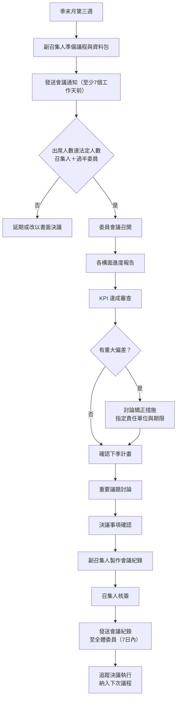

# ESG 委員會運作程序

document_id: PRO-ESG-COMMITTEE

## 1. 目的與範圍

本程序書規範國軍臺中總醫院 ESG 委員會之組成、職掌、會議運作及決策程序，確保 ESG 政策目標獲得有效的組織治理支撐，並落實 POL-ESG 所宣示之治理承諾。

**適用對象：** ESG 委員會全體成員及醫務企劃管理室執行秘書團隊。

**適用範圍：** 本院所有 ESG 議題之委員會層級決策、審查與監督活動。

## 2. 相關文件

- **parent_policy:** POL-ESG
- **年度工作計畫：** PLN-ANNUAL
- **關鍵時程總表：** MTX-TIMELINE
- **利害關係人矩陣：** MTX-STAKEHOLDER
- **氣候風險矩陣：** MTX-RISK-CLIMATE
- **月度進度表：** FRM-PROGRESS
- **各子程序書：** PRO-GHG-INV、PRO-WASTE、PRO-WATER、PRO-OHS

## 3. 角色與責任（RACI）

### 3.1 委員會組成

| 職位 | 單位 | 姓名/職稱 |
|------|------|------|
| 召集人 | 副院長室 | 副院長 |
| 副召集人（執行秘書） | 醫務企劃管理室 | 主任 |
| 委員 | 行政組 | 組長 |
| 委員 | 醫勤組 | 組長 |
| 委員 | 通資電管理組 | 組長 |
| 委員 | 教學研究室 | 主任 |
| 委員 | 醫療部 | 主任 |
| 委員 | 民眾診療服務處 | 主任 |
| 委員 | 主計室 | 主任 |
| 委員 | 衛材補給保養室 | 主任 |
| 委員 | 聯合採購小組 | 採購官 |
| 委員 | 職業安全衛生室 | 主任 |

### 3.2 RACI 矩陣

| 活動 | 召集人（副院長） | 副召集人（醫務企劃管理室） | 行政組 | 醫勤組 | 通資電管理組 | 醫療部 | 職安衛室 | 其他委員 |
|------|:---:|:---:|:---:|:---:|:---:|:---:|:---:|:---:|
| ESG 政策制定與修訂 | A | R | C | I | I | C | C | I |
| 年度 ESG 目標設定 | A | R | C | C | C | C | C | C |
| 委員會議召集 | R | A | I | I | I | I | I | I |
| 會議議程準備 | I | R | I | I | I | I | I | I |
| 各構面進度報告提交 | I | A | R | R | R | R | R | R |
| KPI 達成審查 | A | R | C | C | C | C | C | C |
| 重大 ESG 決策核定 | R | A | C | C | C | C | C | C |
| 氣候風險評估更新 | A | R | C | I | I | C | I | I |
| 利害關係人溝通執行 | I | A | R | I | I | R | R | R |
| ESG 報告書發布 | A | R | C | C | C | C | C | C |
| 法規遵循監控 | I | A | R | C | I | C | R | C |
| 建案 ESG 監督 | A | R | R | I | I | I | I | I |

**說明：** R=Responsible（負責執行）、A=Accountable（當責核決）、C=Consulted（諮詢提供）、I=Informed（知會通知）

## 4. 程序步驟

### 4.1 委員會運作週期

| 類型 | 頻率 | 召集條件 | 主席 |
|------|------|------|------|
| 定期委員會議 | 每季一次（Q1-Q4 各一次） | 固定排程（每季末月第三週） | 召集人 |
| 臨時委員會議 | 視需要 | 重大 ESG 事件或緊急決策需求 | 召集人或副召集人 |

### 4.2 定期委員會議議程結構

每次定期委員會議應涵蓋以下固定議程：

1. **上次會議決議執行確認**（10 分鐘）：副召集人報告前次決議事項執行情形。
2. **各構面進度報告**（30 分鐘）：各委員依 FRM-PROGRESS 月度進度表報告當季執行狀況。
3. **KPI 達成狀況審查**（20 分鐘）：副召集人彙整 PLN-ANNUAL 年度目標達成情形。
4. **重要議題討論**（20 分鐘）：包含氣候風險更新、法規動態、利害關係人反饋等。
5. **決議事項**（10 分鐘）：確認決議內容、責任單位及完成期限。
6. **臨時動議**（10 分鐘）。

### 4.3 流程圖

### 4.4 步驟說明

1. **會議準備：** 副召集人於會議前至少 7 個工作天發送會議通知，附上議程草案及相關資料，包含各單位 FRM-PROGRESS 填報彙整、KPI 追蹤表。
2. **出席確認：** 法定出席人數為召集人（或其代理人）加上過半數委員（至少 7 人）。
3. **會議主持：** 由召集人主持，召集人無法出席時，授權副召集人代理主持。
4. **決議方式：** 一般事項以共識決為原則；如有爭議，以出席委員過半數同意為決議。
5. **會議紀錄：** 副召集人於會議後 7 個工作天內完成紀錄，經召集人核簽後發送全體委員。
6. **決議追蹤：** 副召集人建立決議追蹤清冊，每月確認執行進度，納入下次委員會議報告。

## 5. 監控與量測（SLA）

| 項目 | SLA 時限 | 負責單位 |
|------|------|------|
| 定期委員會議召開 | 每季末月第三週前 | 醫務企劃管理室 |
| 會議通知發送 | 會議前至少 7 個工作天 | 醫務企劃管理室 |
| 會議紀錄完成 | 會議後 7 個工作天內 | 醫務企劃管理室 |
| FRM-PROGRESS 各單位提交 | 每月最後一個工作天前 | 各委員單位 |
| 臨時委員會議通知 | 至少 3 個工作天前 | 醫務企劃管理室 |
| 決議事項追蹤更新 | 每月月底前 | 醫務企劃管理室 |
| 年度 ESG 報告書發布 | 每年 4 月底前 | 醫務企劃管理室 |

## 6. 紀錄與保存

| 紀錄項目 | 保存期限 | 儲存位置 | 銷毀方式 |
|------|------|------|------|
| 委員會議紀錄（含召集人核簽） | 6 年 | 醫務企劃管理室 | 碎紙銷毀 |
| 會議出席簽到表 | 6 年 | 醫務企劃管理室 | 碎紙銷毀 |
| 決議追蹤清冊 | 6 年 | 醫務企劃管理室 | 系統刪除 |
| FRM-PROGRESS 月度進度表 | 3 年 | 醫務企劃管理室 | 系統刪除 |
| KPI 達成紀錄 | 6 年 | 醫務企劃管理室 | 系統刪除 |
| ESG 報告書（各版次） | 永久 | 醫務企劃管理室 | 不銷毀 |

## 7. 附錄

### 7.1 ESG 委員會職掌表

| 單位 | 主要 ESG 職責 | 負責構面 |
|------|------|------|
| 醫務企劃管理室 | ESG 統籌、盤查管理、評鑑準備、委員會秘書 | E1、S1、G1、G3 |
| 行政組 | 能源管理、廢棄物、水資源、建案管理 | E2、E3、E4、G2 |
| 醫勤組 | 化糞池管理、環境清潔 | E1（化糞池排放） |
| 通資電管理組 | 資訊設備能耗、盤查平臺維護 | E1（電力資料）、E2 |
| 教學研究室 | 研究設備管理、教育訓練 | E1（間接排放）、S1 |
| 醫療部 | 醫療設備管理、醫療廢棄物來源 | E3、S2 |
| 民眾診療服務處 | 病患服務品質、社區關係 | S1、S3 |
| 主計室 | ESG 相關預算審核、費用核實 | G1 |
| 衛材補給保養室 | 醫療耗材採購、廢棄物管理協辦 | E3 |
| 聯合採購小組 | 綠色採購、供應商管理 | E2、E3、G1 |
| 職業安全衛生室 | 職安衛法規遵循、事故管理 | S2 |
