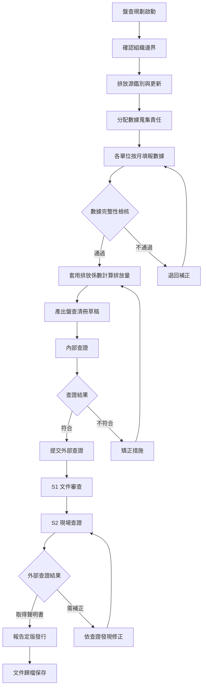

# 溫室氣體盤查程序書

document_id: PRO-GHG-INV

## 1. 目的與範圍

本程序書規範國軍臺中總醫院年度溫室氣體盤查作業之執行流程，確保盤查活動依據 ISO 14064-1:2018 / CNS 14064-1:2021 標準要求，系統性地鑑別、量化與報告組織邊界內之溫室氣體排放。

**適用對象：** 碳盤查小組全體成員及各數據提供單位。

**適用範圍：** 國軍臺中總醫院總院院區（臺中市太平區中山路二段348號），涵蓋類別1直接排放與類別2間接排放之盤查作業。

## 2. 相關文件

- **parent_policy:** POL-ESG
- **參考標準：** ISO 14064-1:2018、CNS 14064-1:2021
- **相關報告：** RPT-GHG-2025、RPT-GHG-2023
- **排放源清冊：** MTX-EMISSION
- **計算方法指引：** GDL-CALC-METHOD
- **數據蒐集表單：** FRM-DATA-FUEL、FRM-DATA-ELEC、FRM-DATA-REF、FRM-DATA-GAS
- **查證程序書：** PRO-GHG-VERIFY

## 3. 角色與責任（RACI）

| 活動 | 副院長（召集人） | 醫務企劃管理室（副召集人） | 行政組 | 醫勤組 | 通資電管理組 | 教學研究室 | 醫療部 | 民眾診療服務處 | 主計室 | 衛材補給保養室 | 聯合採購小組 |
|------|:---:|:---:|:---:|:---:|:---:|:---:|:---:|:---:|:---:|:---:|:---:|
| 盤查規劃與啟動 | A | R | I | I | I | I | I | I | I | I | I |
| 數據蒐集（油料/電力） | I | A | R | C | C | I | I | I | I | I | I |
| 數據蒐集（化糞池） | I | A | I | R | I | I | I | I | I | I | I |
| 數據蒐集（冷媒/氣體） | I | A | R | I | I | I | R | I | I | R | I |
| 排放量計算 | I | R | C | C | C | I | I | I | I | I | I |
| 數據品質檢核 | A | R | C | C | C | C | C | C | C | C | C |
| 盤查平臺維護 | I | A | I | I | R | I | I | I | I | I | I |
| 內部查證 | A | R | C | C | C | C | C | C | C | C | C |
| 報告書撰寫與定版 | A | R | C | C | C | C | C | C | C | C | C |

**說明：** R=Responsible（負責執行）、A=Accountable（當責核決）、C=Consulted（諮詢提供）、I=Informed（知會通知）

## 4. 程序步驟

### 4.1 年度盤查週期

盤查作業依年度循環執行，各階段時程如下：

| 階段 | 時程 | 主要工作 |
|------|------|------|
| 盤查規劃 | Q1（1-3月） | 組織邊界確認、排放源鑑別、表單修訂 |
| 數據蒐集 | Q1-Q4（全年） | 各單位按月填報 FRM 表單 |
| 排放計算 | Q4（12月-1月） | 彙整全年數據、套用排放係數計算 |
| 內部查證 | 1月 | 碳盤查小組執行內部查證 |
| 外部查證 | 1-2月 | 第三方查證機構執行 S1/S2 查證 |
| 報告定版 | 3月 | 依查證結果修訂，定版發行 |

### 4.2 流程圖

### 4.3 數據蒐集頻率與方式

各排放源之數據蒐集頻率及填報方式如下：

| 排放源類別 | 數據蒐集頻率 | 填報方式 | 負責單位 |
|------|------|------|------|
| 油料（柴油、汽油、車用尿素） | **每月**（月報） | 行政組承辦人依採購發票/加油憑證填報 FRM-DATA-FUEL，次月 15 日前完成 | 行政組 |
| 外購電力 | **每月**（月報） | 行政組承辦人依台電電費帳單填報 FRM-DATA-ELEC，次月 15 日前完成 | 行政組 |
| 冷媒補充 | **每次發生**（事件觸發） | 行政組承辦人於維修/補充後 5 個工作天內填報 FRM-DATA-REF | 行政組 |
| 氣體鋼瓶/滅火器 | **每次發生**（事件觸發） | 行政組承辦人依撥發/採購紀錄填報 FRM-DATA-GAS | 行政組 |
| 化糞池甲烷（人員在院時間） | **每季**匯入年度計算 | 醫勤組依人事差勤系統統計在院人時，年度彙整 | 醫勤組 |

**數據蒐集方式說明：**

- **月報制（油料、電力）：** 各月數據於次月 15 日前完成填報，全年共 12 筆月報。數據填報後由行政組組長複核，異常數據（較前月增減超過 20%）應備註說明。
- **事件觸發制（冷媒、氣體鋼瓶）：** 每次補充或購買時即填報，不按月彙整。年度盤查時匯入全年累計量。
- **年度估算（化糞池）：** 依當年度全院員工及病患在院人時（人數 × 每日在院時數 × 工作/就醫天數）估算，人時數據來源為人事差勤系統及門診/住院統計。

### 4.4 步驟說明

1. **盤查規劃啟動：** 副召集人於每年 Q1 召開啟動會議，確認本年度盤查範圍與時程。
2. **確認組織邊界：** 依營運控制法確認組織邊界，排除非本院營運控制之設施。
3. **排放源鑑別與更新：** 依 MTX-EMISSION 清冊更新排放源，進行重大間接排放源鑑別。
4. **分配數據蒐集責任：** 依 RACI 矩陣分配各排放源數據蒐集責任。
5. **各單位按月填報數據：** 各權責單位依 FRM 表單按月填報活動數據。
6. **數據完整性檢核：** 副召集人確認各月數據之完整性與一致性。
7. **套用排放係數計算排放量：** 依 GDL-CALC-METHOD 指引計算各排放源之溫室氣體排放量。
8. **產出盤查清冊草稿：** 彙整所有排放源計算結果，產出盤查清冊。
9. **內部查證：** 碳盤查小組依 PRO-GHG-VERIFY 執行內部查證。
10. **提交外部查證：** 內部查證通過後，委託第三方查證機構執行外部查證。
11. **報告定版發行：** 取得查證聲明書後，報告定版並歸檔。

## 5. 監控與量測（SLA）

| 項目 | SLA 時限 | 負責單位 |
|------|------|------|
| 各月數據填報截止 | 次月 15 日前 | 各數據提供單位 |
| 年度數據彙整完成 | 1 月 15 日前 | 醫務企劃管理室 |
| 內部查證完成 | 1 月底前 | 碳盤查小組 |
| S1 文件審查完成 | 1 月底前 | 外部查證機構 |
| S2 現場查證完成 | 2 月底前 | 外部查證機構 |
| 報告定版發行 | 3 月底前 | 醫務企劃管理室 |
| 查證發現矯正回覆 | 收到發現後 7 個工作天內 | 醫務企劃管理室 |

## 6. 紀錄與保存

| 紀錄項目 | 保存期限 | 儲存位置 | 銷毀方式 |
|------|------|------|------|
| 活動數據原始憑證（發票、帳單） | 6 年 | 各權責單位存查 | 碎紙銷毀 |
| 電子活動數據檔案 | 6 年 | 溫室氣體盤查作業平臺 | 系統刪除 |
| 盤查報告書（各版次） | 6 年 | 醫務企劃管理室 | 碎紙銷毀 |
| 查證聲明書 | 6 年 | 醫務企劃管理室 | 碎紙銷毀 |
| 內部查證紀錄 | 6 年 | 醫務企劃管理室 | 碎紙銷毀 |
| RACI 核定紀錄 | 6 年 | 醫務企劃管理室 | 碎紙銷毀 |

## 7. 附錄

### 7.1 相關 FRM 表單清單

| 表單編號 | 表單名稱 | 填報頻率 | 負責單位 |
|------|------|------|------|
| FRM-DATA-FUEL | 油料月報表 | 每月 | 行政組 |
| FRM-DATA-ELEC | 電力月報表 | 每月 | 行政組 |
| FRM-DATA-REF | 冷媒紀錄表 | 每次發生 | 行政組 |
| FRM-DATA-GAS | 氣體/滅火器紀錄表 | 每次發生 | 行政組 |

### 7.2 碳盤查小組業務執掌

| 單位 | 成員 | 職稱 | 執掌 |
|------|------|------|------|
| 碳盤查小組 | 召集人 | 副院長 | 召集碳盤查小組，督管碳盤查各項業務執行推展。 |
| 醫務企劃管理室 | 副召集人 | 主任 | 協助召集人，督管碳盤查各項業務執行推展。 |
| 行政組 | 組員 | 組長 | 管理廚房、車輛、電力等設備，協助直接、間接排放盤查。 |
| 醫勤組 | 組員 | 組長 | 管理化糞池等設備，協助直接排放盤查。 |
| 通資電管理組 | 組員 | 組長 | 管理資訊設備，協助盤查平臺介接。 |
| 教學研究室 | 組員 | 主任 | 管理教學設備及研究經費支用審核，協助間接排放盤查。 |
| 醫療部 | 組員 | 主任 | 管理醫療裝備，協助直接、間接排放盤查。 |
| 民眾診療服務處 | 組員 | 主任 | 各項經費支用審核，協助間接排放盤查。 |
| 主計室 | 組員 | 主任 | 各項經費支用審核，協助間接排放盤查。 |
| 衛材補給保養室 | 組員 | 主任 | 管理醫療裝備，協助直接、間接排放盤查。 |
| 聯合採購小組 | 組員 | 採購官 | 各物品、財產採購審核，協助間接排放盤查。 |
