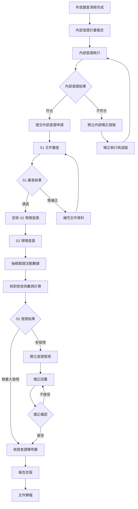

# 溫室氣體查證程序書

document_id: PRO-GHG-VERIFY

## 1. 目的與範圍

本程序書規範國軍臺中總醫院溫室氣體盤查報告書之內部查證與外部查證作業流程，確保盤查結果之正確性、完整性與可信度，並符合 ISO 14064-3:2019 查證規範要求。

**適用對象：** 碳盤查小組全體成員（內部查證）、外部查證機構（外部查證）。

**適用範圍：** 國軍臺中總醫院年度溫室氣體盤查報告書之查證作業，涵蓋類別1直接排放與類別2間接排放。

## 2. 相關文件

- **parent_policy:** POL-ESG
- **參考標準：** ISO 14064-1:2018、ISO 14064-3:2019、CNS 14064-1:2021
- **盤查程序書：** PRO-GHG-INV
- **相關報告：** RPT-GHG-2025
- **排放源清冊：** MTX-EMISSION
- **計算方法指引：** GDL-CALC-METHOD

## 3. 角色與責任（RACI）

| 活動 | 副院長（召集人） | 醫務企劃管理室（副召集人） | 碳盤查小組組員 | 外部查證機構 |
|------|:---:|:---:|:---:|:---:|
| 查證計畫擬定 | A | R | C | I |
| 內部查證執行 | A | R | R | - |
| 矯正措施追蹤 | I | A | R | I |
| 外部查證委託 | A | R | I | I |
| S1 文件提交 | I | R | C | A |
| S2 現場配合 | I | R | R | A |
| 查證發現回覆 | A | R | C | I |
| 查證聲明書接收 | A | R | I | R |

**說明：** R=Responsible（負責執行）、A=Accountable（當責核決）、C=Consulted（諮詢提供）、I=Informed（知會通知）

## 4. 程序步驟

### 4.1 查證作業階段

| 階段 | 時程 | 說明 |
|------|------|------|
| 內部查證 | 每年 1 月上旬 | 碳盤查小組自行檢核盤查清冊與計算結果 |
| S1 文件審查 | 每年 1 月下旬 | 外部查證機構審閱報告書文件 |
| S2 現場查證 | 每年 2 月上旬 | 外部查證機構至現場抽樣查核 |
| 報告修正 | S2 後 7 個工作天 | 依查證發現進行修正 |
| 取得聲明書 | 2-3 月 | 外部查證機構核發查證聲明書 |

### 4.2 流程圖

### 4.3 內部查證步驟

1. **擬定查證計畫：** 副召集人擬定內部查證計畫，含查核範圍、抽樣方法、時程。
2. **文件審查：** 檢核盤查報告書各章節之完整性與格式合規性。
3. **數據驗證：** 抽樣核對活動數據與原始憑證之一致性。
4. **計算複核：** 重新計算抽樣排放源之排放量，確認計算正確性。
5. **係數確認：** 確認排放係數與 GWP 值之引用來源與版本。
6. **開立發現：** 記錄不符合事項與改善建議。
7. **矯正追蹤：** 追蹤矯正措施之完成與有效性。

### 4.4 外部查證步驟

1. **委託查證機構：** 選定具備 ISO 14065 認證之第三方查證機構（本院委託立恩威國際驗證股份有限公司）。
2. **S1 文件審查：** 查證機構審閱盤查報告書、數據清冊、計算方法等文件。
3. **S2 現場查證：** 查證機構至現場進行抽樣查核，包含設備勘查、數據追溯、人員訪談。
4. **查證發現處理：** 依查證發現類型（不符合事項/觀察事項/改善機會）進行回覆。
5. **取得聲明書：** 確認所有不符合事項已結案後，取得查證聲明書。

### 4.5 保證等級

| 類別 | 保證等級 | 說明 |
|------|------|------|
| 類別 1 直接排放 | 合理保證 | 依 ISO 14064-3 規範執行 |
| 類別 2 間接排放 | 合理保證 | 依 ISO 14064-3 規範執行 |

## 5. 監控與量測（SLA）

| 項目 | SLA 時限 | 負責單位 |
|------|------|------|
| 內部查證完成 | 1 月 15 日前 | 碳盤查小組 |
| 內部矯正措施完成 | 內部查證後 5 個工作天 | 各權責單位 |
| S1 文件提交 | 1 月 20 日前 | 醫務企劃管理室 |
| S1 審查完成 | 1 月底前 | 外部查證機構 |
| S2 現場查證完成 | 2 月中旬前 | 外部查證機構 |
| 查證發現矯正回覆 | 收到發現後 7 個工作天內 | 醫務企劃管理室 |
| 取得查證聲明書 | 3 月底前 | 外部查證機構 |

## 6. 紀錄與保存

| 紀錄項目 | 保存期限 | 儲存位置 | 銷毀方式 |
|------|------|------|------|
| 內部查證計畫 | 6 年 | 醫務企劃管理室 | 碎紙銷毀 |
| 內部查證紀錄 | 6 年 | 醫務企劃管理室 | 碎紙銷毀 |
| 內部矯正措施追蹤表 | 6 年 | 醫務企劃管理室 | 碎紙銷毀 |
| 外部查證報告 | 6 年 | 醫務企劃管理室 | 碎紙銷毀 |
| 查證發現與矯正回覆 | 6 年 | 醫務企劃管理室 | 碎紙銷毀 |
| 查證聲明書 | 6 年 | 醫務企劃管理室 | 碎紙銷毀 |

## 7. 附錄

### 7.1 外部查證機構資訊

| 項目 | 內容 |
|------|------|
| 查證機構名稱 | 立恩威國際驗證股份有限公司 |
| 查證標準 | ISO 14064-3:2019 |
| 查證範圍 | 類別 1 與類別 2 |
| 保證等級 | 合理保證 |

### 7.2 查證發現分類

| 類型 | 定義 | 處理方式 |
|------|------|------|
| 不符合事項（Non-conformity） | 違反 ISO 14064-1 標準要求 | 必須矯正並提交佐證 |
| 觀察事項（Observation） | 有改善空間但未違反標準 | 建議改善，下次查證追蹤 |
| 改善機會（Opportunity for Improvement） | 可精進之處 | 納入持續改善計畫 |

### 7.3 查證作業時程（2025年度範例）

| 日期 | 事項 |
|------|------|
| 2026/01/10 | 內部查證完成 |
| 2026/01/20 | S1 文件審查 |
| 2026/02/03 | S2 現場查證 |
| 2026/02/13 | S2 查證後提交修正版本 |
| 2026/03/06 | 報告最終定版 |
