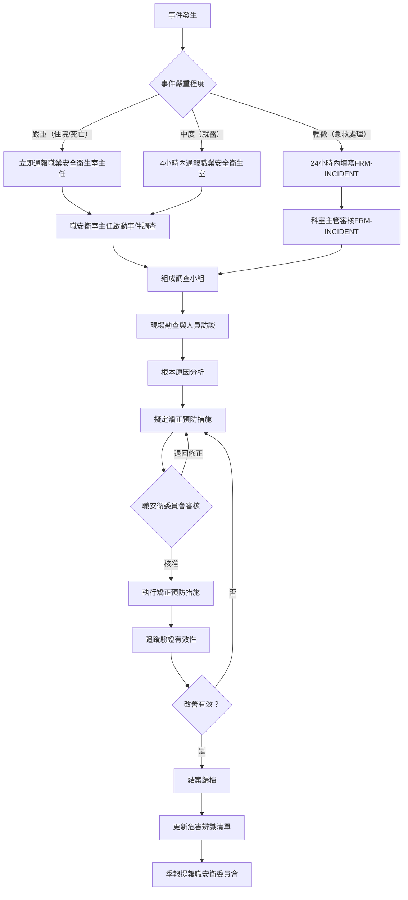

# 職業安全衛生管理程序

document_id: PRO-OHS

## 1. 目的與範圍

本程序書規範國軍臺中總醫院職業安全衛生管理作業，涵蓋危害辨識、風險評估、事件通報、個人防護具使用及教育訓練等核心作業，確保全體員工工作環境符合職業安全衛生法及相關法規要求。

**適用對象：** 全體正式編制人員、約聘人員及進駐廠商人員。

**適用範圍：** 國軍臺中總醫院總院院區（臺中市太平區中山路二段 348 號）全體作業場所，包含臨床作業區、手術室、放射科、實驗室、行政區及後勤設施。

## 2. 相關文件

- **parent_policy:** POL-ESG
- **參考法規：** 職業安全衛生法（民國 112 年修正）、職業安全衛生設施規則、職業安全衛生教育訓練規則、醫療機構勞工安全衛生設施規則
- **相關文件：** REG-OHS-COMMITTEE（職安衛委員會會議紀錄）、FRM-INCIDENT（職災異常事件通報表）、STD-ACCRED（醫院評鑑基準摘要）
- **上位政策：** POL-ESG（ESG 管理政策）

## 3. 角色與責任（RACI）

| 活動 | 院長 | 職業安全衛生室 | 各科室主管 | 人事單位 | 醫勤組 | 行政組 |
|------|:---:|:---:|:---:|:---:|:---:|:---:|
| 職安衛政策核定 | A | R | I | I | I | I |
| 危害辨識與風險評估 | I | R | C | I | C | C |
| 職安衛委員會召開 | A | R | C | I | I | I |
| 事件通報受理 | I | R | C | I | I | I |
| 事件調查與矯正 | I | R | A | I | C | C |
| PPE 採購與配發 | I | A | C | I | I | R |
| 教育訓練規劃與執行 | I | R | C | C | I | I |
| 法規遵循監控 | I | R | I | I | I | I |
| 年度職安衛計畫 | A | R | C | I | I | I |

**說明：** R=Responsible（負責執行）、A=Accountable（當責核決）、C=Consulted（諮詢提供）、I=Informed（知會通知）

## 4. 程序步驟

### 4.1 危害辨識與風險評估

危害辨識涵蓋以下類型，依作業場所及人員職務進行：

| 危害類型 | 主要作業場所 | 常見危害情境 |
|------|------|------|
| 生物性危害 | 臨床作業區、手術室、隔離病房 | 針扎、血液體液暴露、傳染性飛沫接觸 |
| 化學性危害 | 實驗室、放射科、手術室、消毒室 | 化學藥品暴露、消毒劑吸入、化療藥物接觸 |
| 物理性危害 | 放射科、核子醫學科 | 輻射暴露 |
| 人因性危害 | 護理站、病房、急診 | 搬運傷患、長時間站立、輪班作業 |
| 暴力危害 | 急診、精神科、門診 | 病患或家屬攻擊行為 |
| 跌倒危害 | 全院走廊、樓梯、廁所 | 地面濕滑、不良照明、電線橫跨 |

危害辨識每年至少執行一次，作業場所重大變更時立即重新評估。

### 4.2 流程圖

### 4.3 步驟說明

**針扎事件處理流程：**

1. 立即以流動清水沖洗傷口至少 5 分鐘，不得擠壓。
2. 傷口消毒後，立即通知科室主管，並於 4 小時內填寫 FRM-INCIDENT。
3. 評估感染源病患血液傳染病狀態（HIV、HBV、HCV），安排追蹤抽血。
4. 職業安全衛生室依評估結果決定是否啟動暴露後預防用藥（PEP）。
5. 進行根本原因分析，提出改善措施。

**跌倒事件處理流程：**

1. 第一目擊者評估傷患狀態，必要時啟動緊急醫療。
2. 保存現場，拍照記錄。
3. 科室主管確認後 24 小時內完成 FRM-INCIDENT 填寫及回報。
4. 分析地點、時段、環境因素，提出環境改善措施。

**化學暴露事件處理流程：**

1. 立即移離暴露現場，移至新鮮空氣處。
2. 皮膚或眼部接觸：以大量清水沖洗 15 分鐘以上。
3. 依化學品安全資料表（SDS）進行後續處置。
4. 通報職業安全衛生室，填寫 FRM-INCIDENT。

## 5. 監控與量測（SLA）

| 項目 | SLA 時限 | 負責單位 |
|------|------|------|
| 嚴重職災事件通報（職安衛室主任） | 事件發生後 1 小時內 | 事件所在科室主管 |
| 中度職災事件通報 | 事件發生後 4 小時內 | 事件所在科室主管 |
| FRM-INCIDENT 填寫完成 | 輕微事件 24 小時內；中度事件 4 小時內 | 通報人 |
| 根本原因分析完成 | 事件發生後 7 個工作天內 | 職業安全衛生室 |
| 矯正預防措施執行完成 | 依委員會核定期限（最長 30 個工作天） | 主責單位 |
| 危害辨識年度更新 | 每年 1 月底前 | 職業安全衛生室 |
| 職安衛委員會召開 | 每季一次，不得連續兩季未召開 | 職業安全衛生室 |
| 新進人員職安衛教育訓練 | 到職後 7 個工作天內完成 | 職業安全衛生室 |

## 6. 紀錄與保存

| 紀錄項目 | 保存期限 | 儲存位置 | 銷毀方式 |
|------|------|------|------|
| FRM-INCIDENT（職災通報表） | 10 年 | 職業安全衛生室 | 碎紙銷毀 |
| 職安衛委員會會議紀錄（REG-OHS-COMMITTEE） | 7 年 | 職業安全衛生室 | 碎紙銷毀 |
| 危害辨識與風險評估紀錄 | 5 年 | 職業安全衛生室 | 碎紙銷毀 |
| 教育訓練出席紀錄 | 5 年 | 職業安全衛生室 | 碎紙銷毀 |
| PPE 配發領用紀錄 | 3 年 | 行政組 | 碎紙銷毀 |
| 職業病診斷及補償紀錄 | 30 年 | 職業安全衛生室 | 碎紙銷毀 |

## 7. 附錄

### 7.1 個人防護具（PPE）配置標準

| 作業類型 | 必要 PPE | 補充說明 |
|------|------|------|
| 一般臨床作業 | 手術手套、外科口罩 | 接觸病患前後洗手 |
| 侵入性操作（靜脈穿刺、縫合） | 手術手套、外科口罩、保護眼鏡 | 必要時加穿防水圍裙 |
| 化療藥物調配及給藥 | 化療手套（雙層）、N95 口罩、護目鏡、防護衣、鞋套 | 應於負壓隔離藥物調配台進行 |
| 放射線作業 | 鉛衣、甲狀腺護套、鉛眼鏡、個人劑量計 | 個人劑量計每月讀值 |
| 廢棄物清理 | 防穿刺厚橡膠手套、防水圍裙、安全鞋 | 禁止徒手處理利器容器 |
| 隔離病房作業 | N95 口罩、防護衣、手套、護目鏡或面罩 | 依感染管制室指示執行 |

### 7.2 教育訓練排程

| 訓練項目 | 頻率 | 對象 | 主辦單位 |
|------|------|------|------|
| 職安衛基礎訓練（新進） | 到職後 7 日內 | 全體新進人員 | 職業安全衛生室 |
| 年度在職訓練 | 每年一次 | 全體人員 | 職業安全衛生室 |
| 針扎防護專項訓練 | 每兩年一次 | 臨床工作人員 | 職業安全衛生室 |
| 化學品安全訓練 | 每兩年一次 | 實驗室、藥劑部、放射科人員 | 職業安全衛生室 |
| 輻射防護訓練 | 依法規規定 | 放射線工作人員 | 職業安全衛生室、放射科 |
| 緊急應變訓練 | 每半年演練一次 | 全體人員 | 職業安全衛生室、行政組 |
