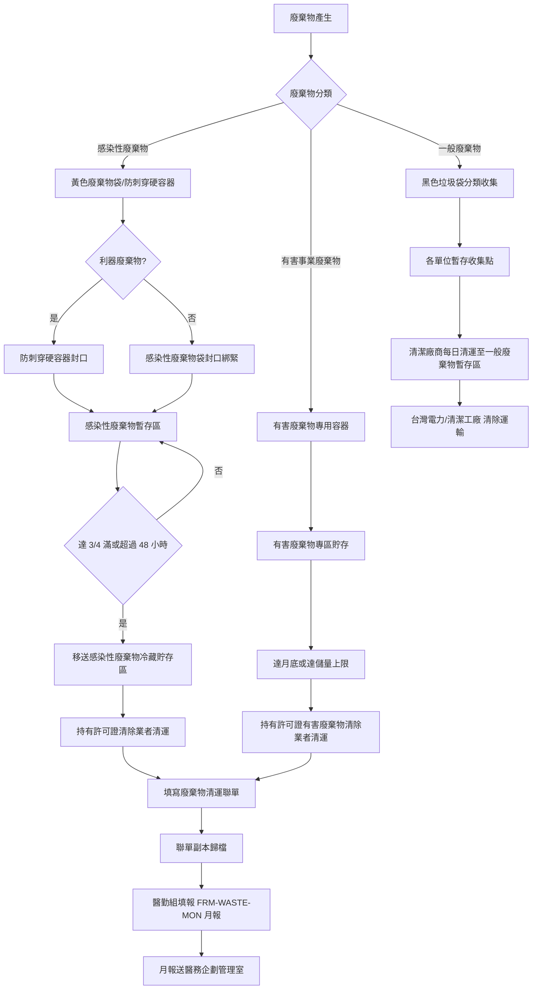

# 醫療廢棄物管理程序

document_id: PRO-WASTE

## 1. 目的與範圍

本程序書規範國軍臺中總醫院醫療廢棄物之分類、蒐集、貯存、清除及最終處理作業，確保廢棄物管理符合廢棄物清理法、事業廢棄物貯存清除處理方法及設施標準，以及醫療機構廢棄物相關法規要求，防止環境污染及感染風險。

**適用對象：** 全院各單位人員（含外包廠商、駐院人員）；廢棄物清除運輸及處理業者。

**適用範圍：** 國軍臺中總醫院總院院區全部廢棄物產出活動，涵蓋三大類別：一般廢棄物、感染性廢棄物（事業廢棄物）、有害事業廢棄物。

## 2. 相關文件

- **parent_policy:** POL-ESG
- **相關法規標準：** STD-WASTE-REG（廢棄物管理法規摘要）
- **相關表單：** FRM-WASTE-MON（廢棄物月報表）
- **外部法規：**
  - 廢棄物清理法（中華民國環境部主管）
  - 事業廢棄物貯存清除處理方法及設施標準（環境部）
  - 醫療廢棄物管理辦法（衛生福利部）
  - 感染性事業廢棄物清理及管制作業要點（環境部）

## 3. 角色與責任（RACI）

| 活動 | 院長 | 醫勤組組長 | 醫勤組承辦人 | 各單位護理長/主任 | 清潔外包廠商 | 醫務企劃管理室 |
|------|:---:|:---:|:---:|:---:|:---:|:---:|
| 廢棄物分類政策訂定 | A | R | C | I | I | C |
| 各單位廢棄物分類執行 | I | A | C | R | C | I |
| 感染性廢棄物包裝與標示 | I | A | C | R | C | I |
| 暫存區日常管理與清潔 | I | A | R | C | R | I |
| 廢棄物聯單（申報）管理 | I | A | R | I | I | C |
| 清除業者作業監督 | I | A | R | I | - | I |
| 月報表彙整與回報 | I | A | R | C | I | I |
| 法規合規檢查 | A | R | C | I | I | C |
| 人員教育訓練 | A | R | R | C | C | C |

**說明：** R=Responsible（負責執行）、A=Accountable（當責核決）、C=Consulted（諮詢提供）、I=Informed（知會通知）

## 4. 程序步驟

### 4.1 廢棄物分類定義

本院廢棄物依性質分為三大類：

| 類別 | 定義 | 容器顏色/標示 | 主要來源 |
|------|------|------|------|
| **一般廢棄物** | 不具感染性、毒性或其他危害特性之廢棄物（生活垃圾、紙類等） | 黑色垃圾袋 | 行政辦公室、餐廳、一般清潔 |
| **感染性廢棄物** | 接觸病患血液、體液、分泌物或排泄物，具感染潛力之廢棄物；含利器廢棄物（針頭、刀片）及病理性廢棄物 | 黃色廢棄物袋 + 感染性廢棄物標示；利器使用防刺穿硬容器 | 病房、手術室、檢驗室、急診 |
| **有害事業廢棄物** | 含有害特性（毒性、腐蝕性、易燃性等）之事業廢棄物，包含廢棄化學品、廢藥品、廢顯影液、汞製品等 | 依物質性質使用對應容器；貼有害廢棄物標籤 | 藥局、X光室、病理室、檢驗室 |

### 4.2 流程圖

### 4.3 步驟說明

**步驟 1：廢棄物分類（各單位責任）**
各單位人員依 4.1 定義於廢棄物產生點立即完成分類，不得將感染性廢棄物混入一般廢棄物。

**步驟 2：感染性廢棄物包裝**
- 感染性廢棄物袋裝滿至 3/4 後，以鵝頸式打結封口，放入第二層袋（double bag）後封口。
- 利器廢棄物（針頭、刀片、破碎玻璃）直接放入防刺穿硬容器（黃色或紅色），裝滿至 3/4 後蓋緊封口，不得重複使用。
- 外壁貼上感染性廢棄物標示貼紙（含日期、科別、重量）。

**步驟 3：有害事業廢棄物標示與隔離**
- 廢棄化學品、廢藥品放入對應容器後，貼上有害廢棄物標籤（含化學品名稱、危害標示、產生日期、數量）。
- 不同性質有害廢棄物分開貯存（酸鹼隔離、易燃品與氧化劑隔離）。

**步驟 4：暫存區管理**
- 感染性廢棄物應於 48 小時內移至冷藏貯存區（維持 4°C 以下），或立即清運；不得於室溫暫存超過 48 小時。
- 暫存區應門禁管制、通風良好、有防液體外洩設施。
- 清潔廠商每日清運一般廢棄物，並清潔暫存區。

**步驟 5：清除作業與聯單**
- 感染性廢棄物及有害事業廢棄物之清除，應委託持有環境部核可清除許可證之業者執行。
- 每次清運須填寫廢棄物清運聯單（三聯式）：第一聯由業者保存、第二聯由本院保存、第三聯送主管機關。
- 醫勤組承辦人核對清運重量與聯單記載，確認無誤後簽章。

**步驟 6：月報彙整**
醫勤組承辦人每月底依 FRM-WASTE-MON 彙整當月各類廢棄物清運重量及聯單號碼，送醫務企劃管理室留存，並納入年度 ESG 報告。

## 5. 監控與量測（SLA）

| 項目 | SLA 時限 | 負責單位 |
|------|------|------|
| 感染性廢棄物室溫暫存上限 | 不得超過 48 小時 | 各單位護理長/主任 |
| 感染性廢棄物冷藏溫度維持 | 全程 4°C 以下 | 醫勤組 |
| 廢棄物清運聯單核對完成 | 清運當日完成 | 醫勤組承辦人 |
| 月報表填報截止 | 次月 10 日前 | 醫勤組承辦人 |
| 有害廢棄物貯存上限（依法規） | 不超過 1 年或達貯存上限量 | 醫勤組組長 |
| 不符合分類情事通報與矯正 | 發現後 1 個工作天內通知相關單位 | 醫勤組承辦人 |
| 人員廢棄物管理教育訓練 | 每年至少 1 次（新進人員到職 1 個月內） | 醫勤組組長 |

## 6. 紀錄與保存

| 紀錄項目 | 保存期限 | 儲存位置 | 銷毀方式 |
|------|------|------|------|
| 廢棄物清運聯單（本院存根） | 5 年 | 醫勤組 | 碎紙銷毀 |
| 廢棄物月報表（FRM-WASTE-MON） | 5 年 | 醫務企劃管理室 | 碎紙銷毀 |
| 清除業者許可證影本 | 效期截止後 3 年 | 醫勤組 | 碎紙銷毀 |
| 暫存區溫度紀錄 | 1 年 | 醫勤組 | 碎紙銷毀 |
| 人員教育訓練簽到紀錄 | 3 年 | 醫勤組 | 碎紙銷毀 |
| 不符合事項處理紀錄 | 3 年 | 醫務企劃管理室 | 碎紙銷毀 |

## 7. 附錄

### 7.1 相關 FRM 表單清單

| 表單編號 | 表單名稱 | 填報頻率 | 負責單位 |
|------|------|------|------|
| FRM-WASTE-MON | 廢棄物月報表 | 每月 | 醫勤組 |

### 7.2 廢棄物分類常見問題

**Q：過期藥品（未開封）屬於哪一類廢棄物？**
A：過期藥品屬有害事業廢棄物，需以藥品廢棄物專用容器收集，委託有害廢棄物清除業者處理，不得混入一般廢棄物或排入下水道。

**Q：血液培養瓶（已使用）屬於感染性廢棄物嗎？**
A：是。已使用且接觸病患檢體之培養瓶屬感染性廢棄物，應以黃色廢棄物袋或密封容器收集，並貼感染性廢棄物標示。

**Q：廢棄的一次性手術布單（無血液汙染）應如何分類？**
A：若無可見血液或體液汙染，可分為一般廢棄物。若有可見血液、體液汙染，則應分類為感染性廢棄物。

### 7.3 清除業者資格確認清單

委託清除業者前應確認：
- 環境部核發之廢棄物清除許可證（確認有效期限及許可廢棄物類型）
- 廢棄物處理機構（焚化廠/滅菌廠）之處理許可證
- 清運車輛及設備符合法規要求
- 業者廢棄物申報系統帳號（可上環境部廢棄物申報系統查詢）
