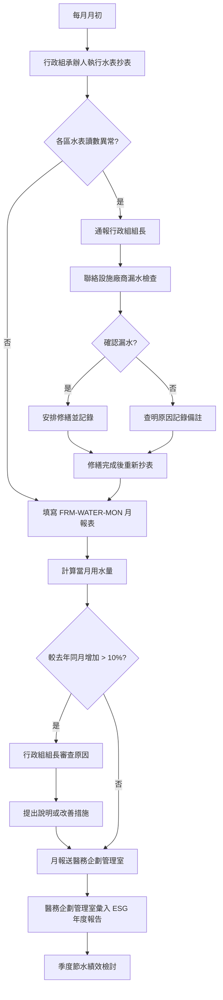

# 水資源管理程序

document_id: PRO-WATER

## 1. 目的與範圍

本程序書規範國軍臺中總醫院水資源之使用追蹤、節水措施推動及水資源再利用評估作業，確保用水數據完整記錄，並依 POL-ESG 環境管理政策推動節水目標，符合自來水法及相關節水法規要求。

**適用對象：** 行政組、醫勤組及全院各用水單位；設施維護廠商。

**適用範圍：** 國軍臺中總醫院總院院區所有水表計量之用水活動，包含自來水使用、設施用水（空調冷卻水、鍋爐用水）及衛生用水。

## 2. 相關文件

- **parent_policy:** POL-ESG
- **相關表單：** FRM-WATER-MON（用水月報表）
- **相關計畫：** PLN-ENERGY（節能減碳行動計畫，水資源管理為 ESG 環境面向之一）
- **外部法規：**
  - 自來水法（經濟部水利署）
  - 節約用水措施辦法（行政院環境保護署）
  - 建築物污水處理設施設計技術規範（內政部）

## 3. 角色與責任（RACI）

| 活動 | 行政組組長 | 行政組承辦人 | 醫勤組組長 | 各單位主管 | 設施維護廠商 | 醫務企劃管理室 |
|------|:---:|:---:|:---:|:---:|:---:|:---:|
| 用水月報彙整與填報 | A | R | C | C | - | I |
| 水表抄表作業 | A | R | - | I | C | I |
| 漏水檢查與修繕 | A | C | R | I | R | I |
| 節水設施安裝與維護 | A | R | C | I | R | I |
| 空調冷卻水塔水質管理 | I | C | A | - | R | I |
| 用水異常事件通報 | A | R | I | R | C | I |
| 節水績效 KPI 追蹤 | I | C | I | I | I | A |
| 水資源再利用可行性評估 | A | R | C | I | C | C |

**說明：** R=Responsible（負責執行）、A=Accountable（當責核決）、C=Consulted（諮詢提供）、I=Informed（知會通知）

## 4. 程序步驟

### 4.1 用水類別

本院用水依用途分為以下類別，各類別均設置獨立或分區水表追蹤：

| 用途類別 | 說明 | 主要用水區域 |
|------|------|------|
| 飲用及衛生用水 | 病患、員工飲水、洗手、沐浴等衛生用水 | 病房、廁所、護理站 |
| 醫療用水 | 手術洗手、滅菌設備、洗腎用水等 | 手術室、中央滅菌室、腎臟透析室 |
| 空調冷卻水 | 冷水主機冷卻水塔補水 | 機房 |
| 鍋爐用水 | 高壓蒸汽滅菌設備、熱水供應系統 | 中央滅菌室、鍋爐房 |
| 清潔用水 | 院區清潔、餐廳廚房用水 | 走廊、院區、廚房 |
| 綠化澆灌 | 院區植栽、庭園澆水 | 戶外院區 |

### 4.2 流程圖

### 4.3 步驟說明

**步驟 1：月度抄表**
行政組承辦人於每月 1~5 日完成全院各水表抄表，記錄各水表讀數（立方公尺）。抄表時留意是否有讀數異常跳升（可能為漏水）。

**步驟 2：異常通報**
若發現某水表單月用水量較前月增加 20% 以上且無合理原因，承辦人應立即通報行政組組長，並聯絡設施維護廠商執行漏水檢查（SLA：通報後 24 小時內開始檢查）。

**步驟 3：節水設施維護確認**
每季抄表後，承辦人確認下列節水設施正常運作：
- 廁所感應式水龍頭、省水馬桶（沖水量 ≤ 6 公升/次）
- 空調冷卻水塔濃縮倍數設定（建議 3~5 倍，減少補水量）
- 綠化澆灌定時器設定（避免白晝高蒸發時段澆水）

**步驟 4：月報填寫**
行政組承辦人依 FRM-WATER-MON 格式填入各水表當月用水量，計算全院合計用水量，並與上月及去年同月比較。月報於次月 10 日前送醫務企劃管理室。

**步驟 5：節水績效季度檢討**
醫務企劃管理室每季彙整用水趨勢，與 PLN-ENERGY 節能計畫之水資源目標對照，提出節水效益說明，納入 ESG 季度進度報告。

**步驟 6：水資源再利用評估**
行政組每年評估一次水資源再利用可行性，評估項目包含：
- **雨水收集：** 屋頂及院區雨水收集後用於植栽澆灌或廁所沖洗之可行性
- **空調冷凝水回收：** 夏季冷氣機冷凝水回收用於植栽澆灌之可行性
- **廢水再生利用：** 評估中水系統（廢水處理後回用）建置可行性

## 5. 監控與量測（SLA）

| 項目 | SLA 時限 | 負責單位 |
|------|------|------|
| 每月抄表完成 | 每月 1~5 日 | 行政組承辦人 |
| 漏水異常通報後檢查啟動 | 通報後 24 小時內 | 設施維護廠商 |
| 漏水修繕完成 | 確認漏水後 5 個工作天內（緊急漏水 4 小時內止漏） | 行政組組長/廠商 |
| 月報填報截止 | 次月 10 日前 | 行政組承辦人 |
| 節水設施定期確認 | 每季一次 | 行政組承辦人 |
| 水資源再利用可行性評估 | 每年 Q4 完成 | 行政組組長 |
| 年度用水目標（節水 5%） | 較前一年年度用水量減少 ≥ 5%（長期目標） | 醫務企劃管理室追蹤 |

## 6. 紀錄與保存

| 紀錄項目 | 保存期限 | 儲存位置 | 銷毀方式 |
|------|------|------|------|
| 用水月報表（FRM-WATER-MON） | 5 年 | 醫務企劃管理室 | 碎紙銷毀 |
| 抄表紀錄原始數據 | 5 年 | 行政組 | 碎紙銷毀 |
| 漏水事件處理紀錄 | 3 年 | 行政組 | 碎紙銷毀 |
| 節水設施維護紀錄 | 3 年 | 行政組 | 碎紙銷毀 |
| 水資源再利用評估報告 | 永久保存 | 醫務企劃管理室 | 不銷毀 |
| 廠商維修單據 | 5 年 | 行政組 | 碎紙銷毀 |

## 7. 附錄

### 7.1 相關 FRM 表單清單

| 表單編號 | 表單名稱 | 填報頻率 | 負責單位 |
|------|------|------|------|
| FRM-WATER-MON | 用水月報表 | 每月 | 行政組 |

### 7.2 節水參考措施

| 節水措施 | 預估節水量 | 適用區域 |
|------|------|------|
| 廁所馬桶換裝 6L 省水型 | 約 30%~40%（相較舊型 15L 馬桶） | 全院廁所 |
| 感應式水龍頭安裝 | 約 30%~50%（相較傳統旋鈕式） | 洗手台、護理站 |
| 冷卻水塔濃縮倍數提升至 5 倍 | 約 20% 補水量節省 | 機房冷水主機 |
| 綠化澆灌改為滴灌系統 | 約 30%~50%（相較噴灑式） | 戶外院區植栽 |
| 蒸汽滅菌機冷凝水回收 | 每次滅菌循環約 10~20 公升 | 中央滅菌室 |

### 7.3 用水異常判斷標準

| 情形 | 判斷標準 | 處置 |
|------|------|------|
| 輕微異常 | 較前月增加 10%~20% | 承辦人查明原因後備註於月報 |
| 明顯異常 | 較前月增加 20% 以上 | 通報組長，執行漏水檢查 |
| 嚴重漏水 | 用水量驟增 50% 以上或發現明顯漏水 | 立即通報並緊急止漏（4小時內） |
